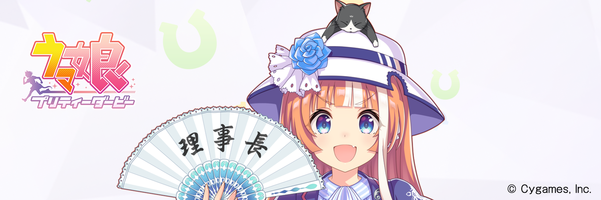

[](https://github.com/MinamiChiwa/Trainers-Legend-G/releases/latest)
[](https://discord.com/invite/TBCSv5hU69)
[](https://qun.qq.com/qqweb/qunpro/share?_wv=3&_wwv=128&inviteCode=1olqdK&from=246610&biz=ka)
# 🏇 Trainers' Legend Gについて (日本のトレーナー向け)
Trainers' Legend Gの使い方のメモやリンクなどをまとめるリポジトリです。

Trainers' Legend Gで不明な事があった場合はここのリポジトリを参照する事で問題の解決ができるでしょう...

READMEにもありますが、「**このプラグインはゲームファイルを変更するため、Cygamesから警告またはBANを受ける可能性があります**」と記載がある通り、リスクを伴う可能性があります。トレーナーが使うかどうかは自己責任でお願いします。

## 📖 各種日本語のREADME
とりあえず日本語のREADMEを参照してください。
フリーカメラの操作やキャラの置換、External-Plugin (外部プラグイン) についての情報を確認できます。Trainers' Legend G 翻訳倉庫ではウマ娘の置換に必要となるIDを確認できたりします。
- [Trainers' Legend G](https://github.com/MinamiChiwa/Trainers-Legend-G/blob/main/readme_JA.md)
- [Trainers-Legend-G-External-Plugin](https://github.com/chinosk6/Trainers-Legend-G-External-Plugin/blob/main/README_JA.md)
- [Trainers' Legend G 翻訳倉庫](https://github.com/MinamiChiwa/Trainers-Legend-G-TRANS/blob/master/readme_ja.md)

## 🥕 各種ダウンロード先
Trainers' Legend Gの本体となるプラグインとExternal-Plugin (外部プラグイン) のダウンロード先です。
- [Trainers' Legend G](https://github.com/MinamiChiwa/Trainers-Legend-G/releases/latest)
- [Trainers-Legend-G-External-Plugin](https://github.com/chinosk6/Trainers-Legend-G-External-Plugin/releases/latest)

## 🍀 Trainers' Legend Gのインストールと使用方法
> [!CAUTION]
> 最新のDMM版ウマ娘は、ゲームのディレクトリ内にTrainers' Legend Gのファイルを入れるとウマ娘が起動しなくなります。

~~ウマ娘のインストールされているディレクトリ (`C:\Users\ユーザー名\Umamusume`) にそれぞれのファイルを入れてください。~~ <br>
~~ファイルを入れた後にウマ娘を起動する事で、Trainers-Legend-G-External-Pluginのウィンドウが自動的に開かれます。~~ <br>
既定では中国語訳とフォントの設定になっているので、**Trainers-Legend-G-External-Pluginの設定で翻訳とフォントの置換を無効化**をしてください。<br>
~~基本的には上記の2つを一緒にインストールする事を強く推奨します。~~

### ⚠ 現バージョンでのインストール方法
1. `C:\Users\ユーザー名\Umamusume` **以外**にディレクトリを作成し、Trainers' Legend Gのファイルを展開してください。
2. `Trainers-Legend-G-External-Plugin`も作成したディレクトリ内に入れてください。
3. 次にWindowsセキュリティのコア分離内にある、「メモリ整合性」を無効化してください(OSの再起動が必要です)。
4. 再起動後にディレクトリに展開した`tlg_starter.exe`を実行します。
5. 実行後に`Now you can start umamusume.`が表示された後、ウマ娘を起動します(Trainers-Legend-G-External-Pluginは自動的に起動します)。

### 📘 補足情報
#### tlg_starter.exeのUAC自動昇格
tlg_starter.exeは起動時にUACの許可を求めます。<br>
これが地味に面倒と感じる場合は、[Skip UAC Prompt](https://www.sordum.org/16219/skip-uac-prompt-v1-2/)を使用することでUACを自動昇格するショートカットが作成できます。
#### ウマ娘の実行を高速化とUACを自動昇格
[DMMGamePlayerFastLauncher](https://github.com/fa0311/DMMGamePlayerFastLauncher)を併用することで、DMMGamePlayerの起動なしでウマ娘の実行とUACの自動昇格を行うショートカットが作成できます。

起動しなかった場合は、DMM版ウマ娘を再インストールとTrainers' Legend Gの設定をし直してください。<br>
FPSや解像度、ストーリーとレースのフルスクリーン化、60FPS化の最適化、ウマ娘の置換設定、ライブのフック制限の解除の設定などを各自で行なってください。

## ❓ FAQ
**Q. Trainers' Legend Gのアップデートは?**

**A. Trainers-Legend-G-External-Pluginを入れてれば自動でアップデートのチェックができます。**

**Q. Trainers' Legend Gの設定がおかしくなりました。**

**A. config.json消す事でリセットできます。~~ファイルは、`C:\Users\ユーザー名\Umamusume`にあります。~~**

## 🌐 チャットでの質問や情報の共有、バグの報告や翻訳の技術的な質問など
公式でDiscordかQQ (中国圏向け) があります。お気軽にご参加ください。
- [Discord](https://discord.com/invite/TBCSv5hU69)
- [QQ](https://qun.qq.com/qqweb/qunpro/share?_wv=3&_wwv=128&inviteCode=1olqdK&from=246610&biz=ka)

## 🔗 補足
[DMMGamePlayerFastLauncher](https://github.com/fa0311/DMMGamePlayerFastLauncher)を使う事でウマ娘のアプリケーションのアップデートをDMMGamePlayerを経由させる必要なしで行えるようになります。
「Trainers-Legend-G-External-Pluginにこれをマージさせてみない?」と話をしましたが、やる気はないそうなので使い分けてください。

Issueで質問や日本語訳の修正などを問い合わせる事ができます。何かあったらどうぞ。

## ⚖ ライセンス
[WTFPL](http://www.wtfpl.net/)

```
            DO WHAT THE FUCK YOU WANT TO PUBLIC LICENSE
                    Version 2, December 2004

 Copyright (C) 2024 Re*Index.(ot_inc)

 Everyone is permitted to copy and distribute verbatim or modified
 copies of this license document, and changing it is allowed as long
 as the name is changed.

            DO WHAT THE FUCK YOU WANT TO PUBLIC LICENSE
   TERMS AND CONDITIONS FOR COPYING, DISTRIBUTION AND MODIFICATION

  0. You just DO WHAT THE FUCK YOU WANT TO.
```

